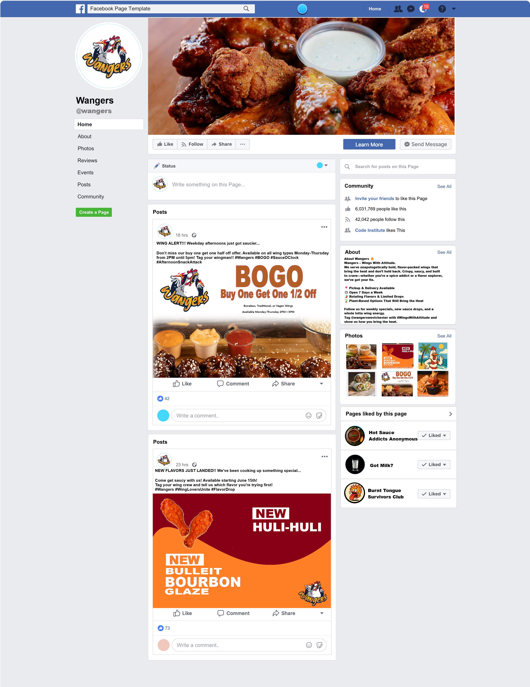

# SEO and Marketing Research

## Table of Contents

- [Keyword Research](#keyword-research)
- [Research of similar businesses](#research-of-similar-businesses)
- [SEO Improvements](#seo-improvements)
- [Marketing Strategies](#marketing-strategies)

## Keyword Research

### Initial Keyword Topic Brainstorming
Below is an initial list of keyword topics:
- Chicken Wings & Flavor Varieties
- Food Delivery & Pickup
- Casual Dining & Takeout
- Late Night Eats & Game Day Food
- Local Eats in [Your City/Region]
- Online Ordering for Wings

### Keyword Brain Dump

| **Topic**            | **Example Keywords**                                                 |
| -------------------- | -------------------------------------------------------------------- |
| Chicken Wings        | spicy wings, boneless wings near me, garlic parmesan wings           |
| Food Delivery        | chicken wing delivery near me, late night wings delivery, fast wings |
| Takeout & Pickup     | wings for pickup, best chicken takeout, hot wings to go              |
| Local Dining         | best wings in New Rochelle, wing spots near me, local chicken joint  |
| Family & Party Meals | party wings platter, family wing meals, wings for groups             |
| Game Day & Events    | wings for game night, Super Bowl food delivery, order wings online   |
| Online Orders        | order wings online, chicken wings app, Wangers delivery menu         |

### Short & Long Term Keywords
A mix of general and specific search terms ensures both wider reach and targeted traffic for Wangers. To build this keyword list, I focused on a combination of short-tail (broad, high-traffic) and long-tail (specific, high-intent) keywords. I used Google Search research to validate and refine our keyword choices by checking Autocomplete Suggestions, the "People Also Ask" Feature, and the Related Searches feature.This process helped surface the real phrases and questions that people use when looking for food like ours — especially chicken wings, delivery/takeout, local dining, and event catering.

| **Short-Tail Keywords** | **Long-Tail Keywords**                                 |
| ----------------------- | ------------------------------------------------------ |
| chicken wings           | best chicken wings near me for delivery                |
| buffalo wings           | spicy buffalo wings with ranch for pickup              |
| wings near me           | crispy wings near me open late                         |
| food delivery           | chicken wing delivery in Westchester open now          |
| wing restaurant         | top-rated chicken wing restaurant in Westchester       |
| fried wings             | order crispy fried wings online                        |
| hot wings               | extra hot wings for game night                         |
| takeout food            | affordable chicken wing takeout meals                  |
| boneless wings          | boneless chicken wing combo with fries                 |
| party wings             | chicken wing platters for birthday or Super Bowl party |
| wing deals              | weekly wing specials for pickup or delivery            |
| order wings             | order chicken wings online with fast checkout          |
| spicy wings             | best spicy chicken wings near me                       |
| wings and sides         | chicken wings with fries or onion rings                |
| pickup wings            | best local pickup for garlic parmesan wings            |
| chicken sandwiches      | best local delivery for spicy chicken sandwiches    |
---

### Testing Keywords for volume and competition

I tested several long-tail keywords using the website [Wordtracker](https://www.wordtracker.com/).

### Final Keyword List
| **Short-Tail Keywords** | **Long-Tail Keywords**                                 |
| ----------------------- | ------------------------------------------------------ |
| chicken wings           | best chicken wings near me for delivery                |
| buffalo wings           | spicy buffalo wings with ranch for pickup              |
| wings near me           | crispy wings near me open late                         |
| wing restaurant         | top-rated chicken wing restaurant in Westchester       |
| hot wings               | extra hot wings for game night                         |
| party wings             | chicken wing platters for birthday or Super Bowl party |
| wing deals              | weekly wing specials for pickup or delivery            |
| order wings             | order chicken wings online with fast checkout          |
| spicy wings             | best spicy chicken wings near me                       |

## Research of similar businesses

## SEO Improvements

**Meta Tag Optimization**

The  and  elements were added to the section of base.html. These provide search engines with concise, relevant information about the content and focus of the site.

**Sitemap Generation**

A sitemap.xml file was generated using [XML Sitemaps](https://www.xml-sitemaps.com/). This file helps search engines efficiently explore and index the site’s structure, boosting visibility and improving crawlability.

**robots.txt Configuration**

A robots.txt file was created to guide search engine crawlers on which areas of the site should or shouldn’t be indexed. It also includes a reference to the sitemap, reinforcing crawl efficiency and demonstrating good site management practices, which can positively impact search rankings.

## Marketing Strategies

### Pre-strategy planning

Wangers is a B2C restaurant concept specializing in freshly prepared, high-quality chicken wings, available for both pickup and delivery within a defined local radius. Rooted in flavor, convenience, and community, the brand is designed to meet the cravings of a diverse local customer base.

To lay the groundwork for our marketing strategy, we first identified where our audience spends time online. Platforms like Instagram and TikTok are ideal for connecting with younger, food-loving users who engage with visual and short-form content. Meanwhile, Facebook provides an effective space for sharing promotions, event updates, and building a broader local presence.

Understanding our customers' needs is key. They’re looking for convenient, crave-worthy meals—perfect for group get-togethers, game nights, or comfort food moments. Content that taps into this—such as behind-the-scenes kitchen clips, flavor reveals, and time-sensitive promotions—can help us meet that demand. Weekly features, short videos, interactive polls, and regular updates via email and social platforms will ensure we stay top-of-mind.

Promotions will be central to customer engagement. Wangers plans to roll out loyalty rewards, bundle offers, and special deals like “Wing Wednesday” or “Buy 10 Get 5 Free.” These types of offers are best delivered through channels where our audience is most active—namely Instagram Stories, Facebook posts, and weekly emails.

Our broader goal is to become the area's go-to destination for wings by combining bold flavors with seamless service. To achieve this, we’ll focus on building brand loyalty through consistent storytelling, active local engagement, and a frictionless ordering process.

Initially, Wangers will rely on organic and low-cost marketing tactics, such as social media content, email campaigns, local collaborations, and community outreach. Once we’ve gained traction, we’ll explore paid advertising options, including Instagram promotions and Google Local Ads, to further expand our reach.

### Social Media Marketing - Mock FB page

The Facebook page complements the website by showcasing new sauces, promoting special offers, and sharing timely updates. It provides customers with opportunities to engage directly—through comments or messages—helping them build a stronger connection with the brand. Overall, the Facebook presence adds an interactive dimension to the business, making it more approachable and personable.

Additionally, the Facebook page can serve as a foundation for expanding onto other platforms like Instagram or Twitter. With the help of content automation tools such as Buffer, Hootsuite, or Later, managing multiple social channels can be streamlined without adding extra workload.

### Location specific online presence - Google My Business

Wangers will register with Google My Business to appear in local map searches (“wings near me”, “hot wings open now”), along with accurate hours, photos, and reviews.

We’ll also explore adding Wangers to local food apps and directories for extended visibility—especially during peak times like weekends and major sports events.

### Email Marketing - Newsletter
