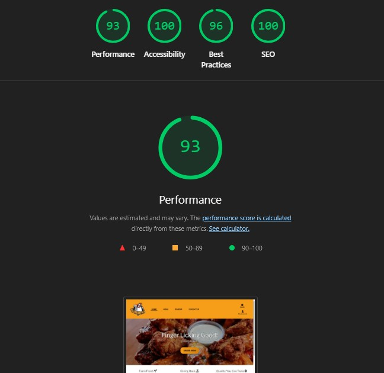
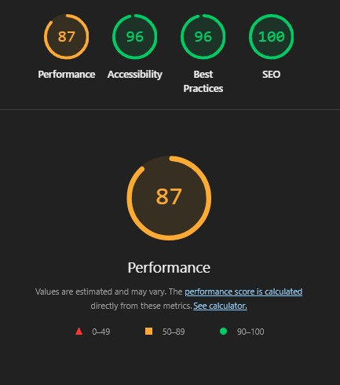
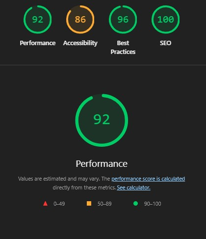
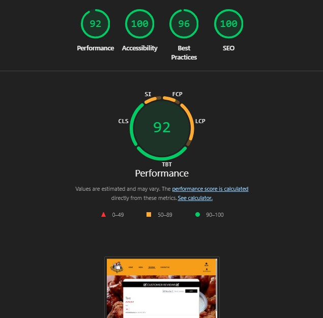
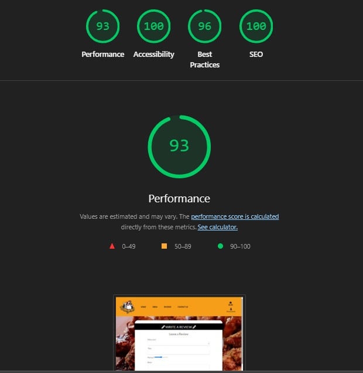
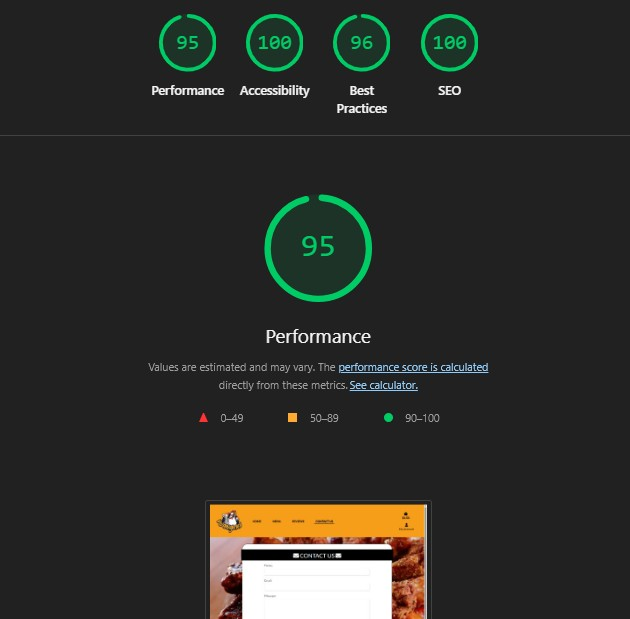
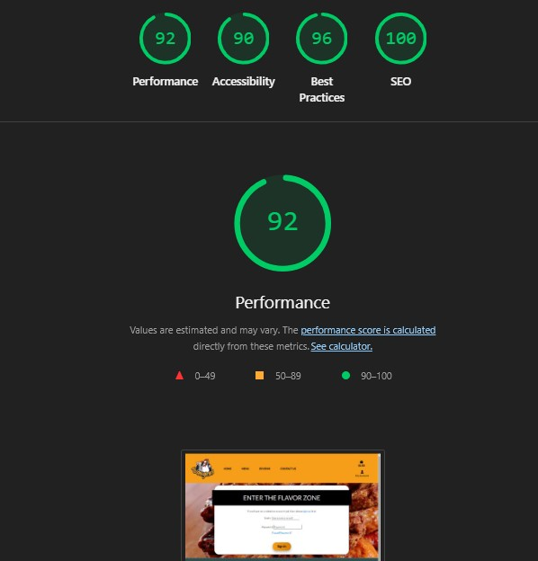

# Wangers Testing

* [Validator Testing](#validator-testing)
    * [HTML Validation](#html-validation)
    * [CSS Validation](#css-validation)
    * [Javascript Validation](#javascript-validation)
    * [Python Pep8 Linter](#python-pep8-linter)
* [Lighthouse Testing](#lighthouse-testing)
* [Additional Manual Testing](#additional-manual-testing)
* [User Story Testing](#user-story-testing)
* [Browser Compatibility](#browser-compatibility)
* [Bugs](#bugs)
* [Known Bugs](#known-bugs)

## Validator Testing

### HTML Validation
The following files all passed through the [HTML Validator](https://validator.w3.org/nu/#textarea) with no errors:

- index.html [Full Results](static/documentation/testing/validator_results/html_home.pdf)
- contact.html
- cart.html
- checkout.html
- checkout_success.html
- profile.html
- review_list.html
- review_form.html
- login.html
- signup.html
- logout.html 

### CSS Validation
The following files passed through the [CSS Validator](https://jigsaw.w3.org/css-validator/#validate_by_input) with no errors:

- base.css [Full Results](static/documentation/testing/validator_results/css_validator.pdf)
- checkout.css
- profile.css

### Javascript Validation

- [Javascript Validator](https://jshint.com)
 - Code from checkout_toggle.js passed through JSHint site with no errors. The following Metrics were logged: There are 3 functions in this file. Function with the largest signature take 1 arguments, while the median is 0. Largest function has 7 statements in it, while the median is 7. The most complex function has a cyclomatic complexity value of 3 while the median is 1.

 - Code from delivery_method_change.js passed through JSHint site with no errors. The following Metrics were logged: There are 5 functions in this file. Function with the largest signature take 1 arguments, while the median is 1. Largest function has 22 statements in it, while the median is 2. The most complex function has a cyclomatic complexity value of 6 while the median is 1.

 - Code from delivery_method.js passed through JSHint site with no errors. The following Metrics were logged: There are 3 functions in this file. Function with the largest signature take 1 arguments, while the median is 0. Largest function has 11 statements in it, while the median is 2. The most complex function has a cyclomatic complexity value of 3 while the median is 1.

 - Code from stripe_elements.js passed through JSHint site with no errors. The following Metrics were logged: There are 8 functions in this file. Function with the largest signature take 1 arguments, while the median is 0.5. Largest function has 10 statements in it, while the median is 2.5. The most complex function has a cyclomatic complexity value of 3 while the median is 1

 - Code from cart_sound.js passed through JSHint site with no errors. The following Metrics were logged: There are 2 functions in this file. Function with the largest signature take 0 arguments, while the median is 0. Largest function has 4 statements in it, while the median is 2.5. The most complex function has a cyclomatic complexity value of 3 while the median is 2.

### Python Pep8 Linter
The following files all passed through the [Python PEP8 Linter](https://pep8ci.herokuapp.com/) with no errors:
    

urls.py

     
    

The following file passed through with no errors on customized code. However, preloaded built in code had a few errors for line length:
    

settings.py

     
    

 
## Lighthouse Testing
- Lighthouse result for index.html

    

- Lighthouse result for menu.html

    

- Lighthouse result for menu_item_detail.html

    

- Lighthouse result for review_list.html

    

- Lighthouse result for review_form.html

    

- Lighthouse result for contact_us.html

    

- Lighthouse result for Authentication Pages

    

## Additional Manual Testing

### Navigation - Navbar

| Feature Tested       | Steps                                                                                            | Expected Outcome                                                                                                              | Results |
| -------------------- | ------------------------------------------------------------------------------------------------ | ----------------------------------------------------------------------------------------------------------------------------- | ------- |
| Home Link Icon       | While not on the homepage, click the Wangers Logo                                                | User is redirected to the homepage.                                                                                           | Pass    |
| Home Link            | White not on the homepage click "Home"                                                           | User is redirected to the homepage.                                                                                           | Pass    |
| Menu Link            | While not on the menu page click "Menu"                                                          | User is redirected to the Menu page.                                                                                          | Pass    |
| Reviews Link         | While not on the reviews page click "Reviews"                                                    | User is redirected to the Reviews page.                                                                                       | Pass    |
| Contact Us Link      | While not on the contact page click "Contact Us"                                                 | User is redirected to the Contact Us page.                                                                                    | Pass    |
| Cart Link            | While on any bag click the bag/cart icon in the header.                                          | User is redirected to the Cart page                                                                                           | Pass    |
| Cart Link (Toast)    | After adding an item to the cart, click on the "Go to Cart" button on the success message toast. | User is redirected to the Cart page                                                                                           | Pass    |
| Register Link        | While not authenticated click, "My Account" then "Register"                                      | User is redirected to the Sign Up page.                                                                                       | Pass    |
| Login Link           | While not authenticated click "My Account" then "Login"                                          | User is redirected to the Login page.                                                                                         | Pass    |
| Logout Link          | While authenticated click "My Account" then "Logout"                                             | User is directed to a buffer page to confirm logout. Clicking the Logout Button again will log the user out of their account. | Pass    |
| My Profile           | While authenticated click "My Account" then "My Profile"                                         | User is redirected to the Profile Page that includes past orders.                                                             | Pass    |
| Menu Management Link | While authenticated as a superuser click "My Account" then "Menu Management"                     | User is redirected to a page where they can add new menu items.                                                               | Pass    |

### Other Navigation

| Feature Tested         | Steps                                                                                      | Expected Outcome                                                                                                                          | Results |
| ---------------------- | ------------------------------------------------------------------------------------------ | ----------------------------------------------------------------------------------------------------------------------------------------- | ------- |
| Order Now Button       | While on the homepage click the "Order Now" button                                         | User is redirected to Menu page.                                                                                                          | Pass    |
| Social Media Links     | While on any page navigate to the footer and click on the various social media icons.      | A new tab will open for the appropriate social media website.                                                                             | Pass    |
| Menu Item Navigation   | While on the menu page click on any of the menu item photos.                               | User is redirected to the Menu Item Details page for that particular item, where they can make selections and add the item to their cart. | Pass    |
| Keep Shopping Button   | While on the Menu Items Detail page and the Checkout page, click the Keep Shopping button. | User is redirected to the Menu page.                                                                                                      | Pass    |
| Secure Checkout Button | While on the Cart page, click on the "Secure Checkout" button                              | User is redirected to the checkout page.                                                                                                  | Pass    |
| Adjust Bag Button      | While on the Checkout page, click the "Adjust Bag" button                                  | User is redirected to the Cart page.                                                                                                      | Pass    |
| Back to Menu Button    | While on the Checkout Success page, click the "Back to Menu" button                        | User is redirected back to the menu page                                                                                                  | Pass    |
| Leave a Review Button  | While on the Reviews Page, click the "Leave a Review" button                               | If authenticated the user is redirected to the review form page. If the user is not authenticated, they are redirected to the login page. | Pass    |

### Authentication
| Feature Tested           | Steps                                                                               | Expected Outcome                                                                                                                                                                                                                         | Results |
| ------------------------ | ----------------------------------------------------------------------------------- | ---------------------------------------------------------------------------------------------------------------------------------------------------------------------------------------------------------------------------------------- | ------- |
| Login                    | As a registered user, go to login page, complete login form and click login button. | Form validation is effective. User is directed to homepage, success message informs of successful login  and navbar updates stating logged in as <username>                                                                              | Pass    |
| Forgot Password function | On Login page, click Forgot Password link.                                          | User is directed to Reset Password page. Form validation is effective. Reset link is sent to user email through which password can be reset.                                                                                             | Pass    |
| Sign Up                  | As unregistered user, go to Sign Up page, complete form and submit                  | Form validation is effective. User will receive confirmation email with link to verify registration. After clicking link, user is directed to Login page.A success message is displayed stating the account registration was successful. | Pass    |
| Logout                   | As authenticated user, got to My Profile > Logout                                   | User is directed to a buffer page to confirm the sign out. After clicking Sign Out button, asuccess message informs user of successful sign out.                                                                                         | Pass    |

### Emails
It is recommended that these tests are run using a temporary email from a site such as [tempmail.org](https://temp-mail.org/).
| Feature Tested       | Steps                                                          | Expected Outcome                                                                                                                                                                                                                 | Results |
| -------------------- | -------------------------------------------------------------- | -------------------------------------------------------------------------------------------------------------------------------------------------------------------------------------------------------------------------------- | ------- |
| Account registration | Navigate to the Registration page and create a new account.    | User is redirected to a page informing them an email was sent for verification. User receives confirmation email with confirmation link. When clicked, link directs user success page with link to login page.                   | Pass    |
| Order Confirmation   | Complete the Checkout Process                                  | User is redirected to an order confirmation page and a message alerts them that an email has been sent to the email provided in checkout. User receives confirmation email.                                                      | Pass    |
| Forgot Password      | Navigate to the Login Page and click the Forgot Password link. | User is redirected to a page informing them a password reset email was sent. User receives reset email with  link. When clicked, link directs user to reset their password, and a success message informs them it was successful | Pass    |
| Contact Us           | Navigate to the Contact Us Page and submit a message           | User receives a pop up message that their message was submitted. User receives email stating same.                                                                                                                               | Pass    |

### External Links
| Feature Tested     | Steps                                  | Expected Outcome                                | Results |
| ------------------ | -------------------------------------- | ----------------------------------------------- | ------- |
| Social media links | Click on any of the social media icons | New tab opens with respective social media site | Pass    |

### Error Page
| Feature Tested  | Steps                                                | Expected Outcome                                                                                             | Results |
| --------------- | ---------------------------------------------------- | ------------------------------------------------------------------------------------------------------------ | ------- |
| Custom 404 page | Append faulty extension to home URL (or simply /404) | Users is directed to customised 404 error page, informing them of invalid URL with a Back to Homepage button | Pass    |

### Menu Page
| Feature Tested                        | Steps                                                                                                        | Expected Outcome                                                                                                                                                                             | Results |
| ------------------------------------- | ------------------------------------------------------------------------------------------------------------ | -------------------------------------------------------------------------------------------------------------------------------------------------------------------------------------------- | ------- |
| Search Feature - Matching Keywords    | Navigate to Menu page and type in a keyword contained in the name or description field of any menu item.     | The Menu page will reload to display only items matching the search criteria.                                                                                                                | Pass    |
| Search Feature - Non-matching Keyword | Navigate to Menu page and type in a keyword not contained in the name or description field of any menu item. | The Menu page will reload to display all items and a Toast message will appear informing the user that we don't have that with a link to our contact form to reach out and suggest it to us. | Pass    |
| Menu Filters                          | From the Menu page click the filter option and select one of the options                                     | The Menu page will reload to display all items relevant to the chosen filter                                                                                                                 | Pass    |
| Menu Detail                           | From the Menu page click on any item image                                                                   | The user is redirected to the menu item detail page for the corresponding item.                                                                                                              | Pass    |

### Menu Detail Page
| Feature Tested        | Steps                                                                  | Expected Outcome                                                                                                                                                                           | Results |
| --------------------- | ---------------------------------------------------------------------- | ------------------------------------------------------------------------------------------------------------------------------------------------------------------------------------------ | ------- |
| Menu Item Detail Page | Click on a menu item from the menu page to view its detail page        | User sees item image, description, price, dietary restrictions, and form for sauce, add-ons, and quantity selection                                                                        | Pass    |
| Sauce Selection       | On a menu item detail page, select a sauce from the dropdown menu      | Selected sauce is submitted with the form and included in cart item metadata                                                                                                               | Pass    |
| Add-ons Selection     | On a menu item detail page, check multiple add-ons and submit the form | Selected add-ons are included in the cart; cart page reflects correct total price including add-on costs                                                                                   | Pass    |
| Add to Cart           | Fill in quantity, select sauce and add-ons, then click “Add to Cart”   | A sound of a chicken clucking occurs. Success message including cart preview appears. Item including all add-ons and sauce selections are added to the cart and totals update accordingly. | Pass    |

### Cart Page
| Feature Tested              | Steps                                                  | Expected Outcome                                                                                                                                                    | Results |
| --------------------------- | ------------------------------------------------------ | ------------------------------------------------------------------------------------------------------------------------------------------------------------------- | ------- |
| Cart Page                   | Add item(s) to cart and go to Cart page via navbar | User is presented with a table of all items in their cart, incl. sauce selections and add -ons, as well as subtotals for all items, delivery cost  and grand total. | Pass    |
| Quantity adjustment buttons | Adjust quantity input value with - or + button         | Value will not go below 1 or above 99.                                                                                                                              | Pass    |
| Update item                 | Change quantity of selected item and click Update      | Success message informs user that quantity for "menu item" was updated to new value. Cart now displays new value, subtotal and grand total.                         | Pass    |
| Remove item                 | Click Remove on any item in cart.                    | Success message informs user that menu item was removed from the cart. Cart now displays new value, subtotals and grand total.                                      | Pass    |
| Keep Shopping button        | Click Keep Shopping button on cart page.             | User is directed to Menu page.                                                                                                                                      | Pass    |
| Checkout button             | Click Go to Checkout button on cart page.            | User is directed to Checkout page.                                                                                                                                  | Pass    |

### Checkout Process
| Feature Tested           | Steps                                                                                                            | Expected Outcome                                                                                                                                                                                                                                                                                                                                                                            | Results |
| ------------------------ | ---------------------------------------------------------------------------------------------------------------- | ------------------------------------------------------------------------------------------------------------------------------------------------------------------------------------------------------------------------------------------------------------------------------------------------------------------------------------------------------------------------------------------- | ------- |
| Anonymous Pickup Order   | While not logged in, navigate to the menu page, add items to cart and checkout with delivery method as pickup.   | The delivery charge will update to $0 and the grand total will update accordingly.Once the user enters valid information in the form and clicks the Checkout button, user will be redirected to a checkout success page, an email confirmation will be send to them, and a toast will pop up informing them that the order was placed successfully and an email confirmation has been sent. | Pass    |
| Anonymous Delivery Order | While not logged in, navigate to the menu page, add items to cart and checkout with delivery method as delivery. | The delivery charge will calculate based on the value of the cart. Once the user enters valid information in the form and clicks the Checkout button, user will be redirected to a checkout success page, an email confirmation will be send to them, and a toast will pop up informing them that the order was placed successfully and an email confirmation has been sent.                | Pass    |
| Logged in Pickup Order   | While authenticated, navigate to the menu page, add items to cart and checkout with delivery method as pickup.   | The delivery charge will update to $0 and the grand total will update accordingly.Once the user enters valid information in the form and clicks the Checkout button, user will be redirected to a checkout success page, an email confirmation will be send to them, and a toast will pop up informing them that the order was placed successfully and an email confirmation has been sent. | Pass    |
| Logged in Delivery Order | While authenticated, navigate to the menu page, add items to cart and checkout with delivery method as delivery. | The delivery charge will calculate based on the value of the cart. Once the user enters valid information in the form and clicks the Checkout button, user will be redirected to a checkout success page, an email confirmation will be send to them, and a toast will pop up informing them that the order was placed successfully and an email confirmation has been sent.                | Pass    |

### Reviews Section
| Feature Tested               | Steps                                                                                                      | Expected Outcome                                                                                                                                                                                                                                                         | Results |
| ---------------------------- | ---------------------------------------------------------------------------------------------------------- | ------------------------------------------------------------------------------------------------------------------------------------------------------------------------------------------------------------------------------------------------------------------------ | ------- |
| Filter                       | From the reviews page, select a menu item from the drop down and click the Filter button                   | The reviews page will render all reviews that are tied to that particular menu item.                                                                                                                                                                                     | Pass    |
| Search                       | From the reviews page, type a search term and click the Filter button                                      | The reviews page will render all reviews containing the keywords.                                                                                                                                                                                                        | Pass    |
| Search (No Reviews)          | From the reviews page, type a search term not included in any review and click the Filter button           | The reviews page will render a message stating No reviews yet.                                                                                                                                                                                                           | Pass    |
| Like Button (like)           | Click the Like Button (Heart Icon) on a post.                                                              | The background will change to red and the like count will increase                                                                                                                                                                                                       | Pass    |
| Like Button (unlike)         | Click the Like Button (Heart Icon) on a post you have previously liked.                                    | The background will change back to white and the count will decrease                                                                                                                                                                                                     | Pass    |
| Like Button (authentication) | As an unauthenticated user, click on the heart button                                                      | An error will appear stating that you must be logged in to like a review.                                                                                                                                                                                                | Pass    |
| Review Form Validation       | Navigate to the Review Form and leave Tile or Body blank.                                                  | An message will appear stating the fields are required                                                                                                                                                                                                                   | Pass    |
| Submit Button                | Fill in the fields in Review Form with valid data and click the Submit button                              | User is redirected to the review list and a success message is rendered stating that the review has been submitted for approval.                                                                                                                                         | Pass    |
| Admin Approval               | Submit a valid review.                                                                                     | Review does not appear on reviews page.                                                                                                                                                                                                                                  | Pass    |
| Admin Approval               | Log into the Admin panel and mark a review as approved.                                                    | Review now appears on the reveiews page.                                                                                                                                                                                                                                 | Pass    |
| Edit/Delete Review Buttons   | As an authenticated user, navigate to the reviews page.                                                    | Any reviews that were submitted by the authenticated user will contain buttons to edit or delete the post.                                                                                                                                                               | Pass    |
| Resubmission after Edit      | As an authenticated user, navigate to the reviews page and click the Edit button on one of your reviews.   | User is redirected to the review form - prepopulated with the previous review. Once submit review is pressed again the review will disappear from the list as it goes back for admin approval, a message will appear stating that the review was submitted for approval. | Pass    |
| Delete Review                | As an authenticated user, navigate to the reviews page and click the Delete button on one of your reviews. | User is redirected to a page to confirm deletion. After confirmation, the post is deleted and the user is redirected back to the reviews page.                                                                                                                           | Pass    |

### Profile & Past Orders Section
| Feature Tested               | Steps                                                                                                                | Expected Outcome                                                                                                                                                                                      | Results |
| ---------------------------- | -------------------------------------------------------------------------------------------------------------------- | ----------------------------------------------------------------------------------------------------------------------------------------------------------------------------------------------------- | ------- |
| Order History View           | Navigate to the My Profile page, from the My Account dropdown in the navigation bar.                                 | A list of all a users past orders will be listed with links to the confirmation pages.                                                                                                                | Pass    |
| Past Order Confirmation View | From the My Profile page, click on an order number from order history.                                               | User will be redirected to a copy of the Checkout Success page from the order. A Toast message will appear stating that it is a past order confirmation and that an email was sent on the order date. | Pass    |
| Profile Information Update   | From the My Profile page, change information in the default delivery section and click the Update Information button | A message will pop up stating that the user profile was successfully updated and this new information will default in the delivery fields in the checkout page now.                                   | Pass    |

### Admin CRUD
| Feature Tested    | Steps                                                                                                                                                         | Expected Outcome                                                                                                                                                                                                                                                    | Results |
| ----------------- | ------------------------------------------------------------------------------------------------------------------------------------------------------------- | ------------------------------------------------------------------------------------------------------------------------------------------------------------------------------------------------------------------------------------------------------------------- | ------- |
| Adding products   | While authenticated as a superuser, navigate to the Menu Management Page and fill in the form.                                                                | Form validation is effective. User is redirected to a blank form to enter another new item. Success alert displays.                                                                                                                                                 | Pass    |
| Editing products  | While authenticated as a superuser, navigate to the Menu Page (or Menu Detail page), and select the Edit link. Update the pre-populated form and submit it.   | Form validation is effective. After clicking Edit, alert tells user that the item has been updated. User is redirected to the menu_item_detail page with updated content. An alert informs the user the update was successful.                                      | Pass    |
| Deleting products | While authenticated as a superuser, navigate to the Menu Page (or Menu Detail page), and select the Delete link. Update the pre-populated form and submit it. | The user is redirected to a buffer page asking them to confirm the deletion. If a user cancels, they are redirected back to the page they came from. If they choose to delete, an alert informs of successful deletion and the user is redirected to the menu page. | Pass    |

## Browser Compatibility
This website was tested on the following browsers:
- Google Chrome Version 137.0.7151.56 (Official Build) (64-bit)
- Microsoft Edge Version 136.0.3240.92 (Official build) (64-bit)
- Mozilla Firefox Version 135.0.1 (64-bit)

## Bugs
1. ValueError at /checkout/"<OrderLineItem: 4 x Boneless Wings on order BF5EC0F52BC34F34891256C8FAC356D2>" needs to have a value for field "id" before this many-to-many relationship can be used.
 - Bug caused by trying to access a many-to-many field before a primary ID was saved. 
 - Fixed by changing the save method on OrderLineItems form: 
    def save(self, *args, **kwargs):
        """ Calculate the lineitem total including add-ons """
        base_price = self.menu_item.price * self.quantity
        addons_total = sum(addon.price for addon in self.addons.all()) * self.quantity
        self.lineitem_total = base_price + addons_total
        super().save(*args, **kwargs)

        TO: 

            def save(self, *args, **kwargs):
        """Calculate the lineitem total including add-ons."""
        base_price = self.menu_item.price * self.quantity
        addons_total = 0
        if self.pk:
            addons_total = sum(
                addon.price for addon in self.addons.all()
            )
        self.lineitem_total = base_price + addons_total
        super().save(*args, **kwargs)

2. Unable to Add Items Without Sauce_ID to cart:
    - Fixed by changing cart handling in contexts.py from: 
        for key, item_data in cart.items():
            item_id, sauce_id = key.split('_')
            item_id = int(item_id)
            sauce_id = int(sauce_id) if sauce_id != 'None' else None
            menu_item = get_object_or_404(MenuItem, pk=item_id)
            sauce = get_object_or_404(Sauce, pk=sauce_id) if sauce_id else None

        to:

        for key, item_data in cart.items():
            parts = key.strip('_').split('_')
            item_id = int(parts[0])
            sauce_id = None
            if len(parts) > 1 and parts[1] not in ('None', ''):
                try:
                    sauce_id = int(parts[1])
                except ValueError:
                    sauce_id = None
            menu_item = get_object_or_404(MenuItem, pk=item_id)
            sauce = get_object_or_404(Sauce, pk=sauce_id) if sauce_id else None

3. Duplicate orders were being created by webhooks. Fixed by a typo in checkout view changing strip_id to stripe_id.
4. Cart was not calculating delivery charge in new session by defauly after completing a pickup order. 
    - Fixed by adding the following code to the checkout view to reset the session after the order is saved:
        request.session['delivery_method'] = 'delivery'
        request.session.modified = True 

## Known Bugs
There are no unaddressed known bugs at this time. 